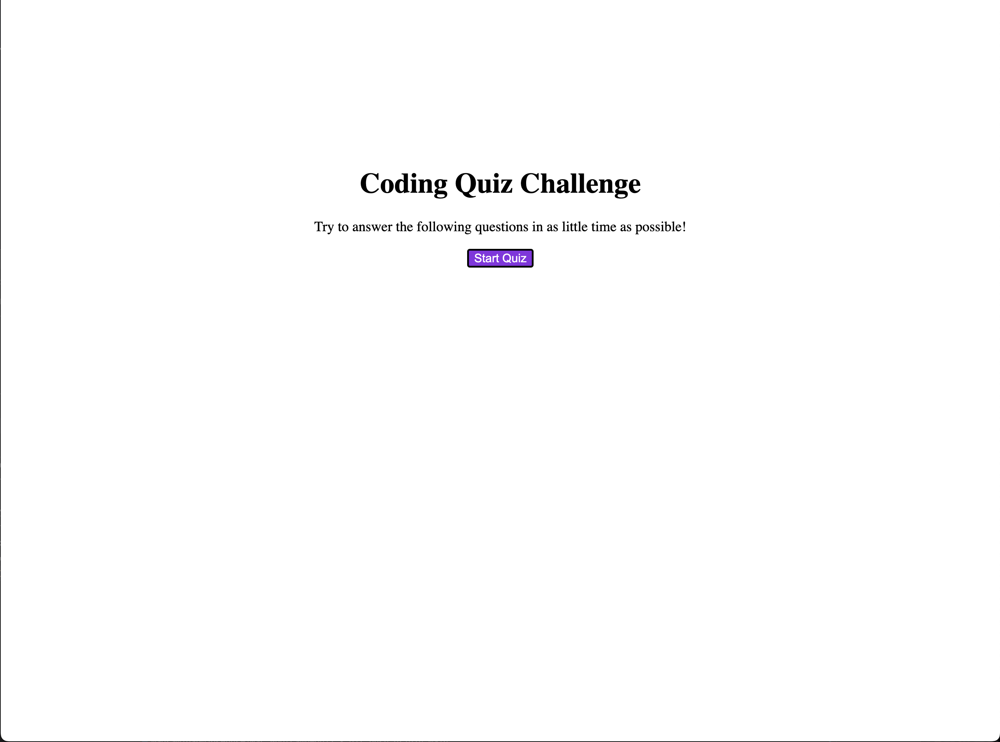

# Bootcamp-Quiz
-To start my code I set up the HTML with a good deal of divs to give me options when setting up the JavaScript.
-Afterwards I did some small CSS changes to make the website at least a little presentable.
-Afterwards I went into the JavaScript and set up some variables.
-At first the variables were not working, but I quickly realized my error was that I didn't put document. in front of my querySelector command.
-Once I got the variables working I set up an object with arrays that had all of the questions and answers.
-Following that I set up a function for the start page, and had that disappear to show the questions.
-I then made functions for correct and incorrect answers  and attached them to the question functions.
-Once all this was done I made some last finishing touches to get the website working as best as I could.

Website Link: https://alphastranger.github.io/Bootcamp-Quiz/